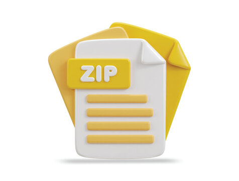

# Microsft Fabric
## Télécharger et extraire des fichiers ZIP - No Code

---

# Création d'un Workspace

---

# Création d'un Lakehouse

---
 
# Création d'un Pipeline

---

# Ajout d'une activité Copy Data (1/2)

- Téléchargement de fichier ZIP
---

# Ajout d'une activité Copy Data (2/2)

-  Extraction du fichier ZIP

---

# Exécution du Pipeline

